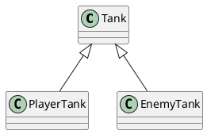

# 深入理解类和接口

关于使用JS面向对象开发
> JS语言没有类型检查，如果使用面向对象的方式开发，会产生大量的接口，而大量的接口会导致调用复杂度剧增，这种复杂度必须通过严格的类型检查来避免错误，尽管可以使用注释或者文档，但是他们没有强约束力

1. TS为前端面向对象开发带来了契机
> TS带来了完整的类型系统，因此开发复杂程序时，无论接口数量有多少，都可以获得完整的类型检查，并且这种检查是具有强约束力的。
2. 面向对象中有许多非常成熟的模式，能处理复杂问题

## 类的继承

继承可以描述类与类之间的关系

如果A和B都是类，并且可以描述为A是B, 则A和B形成继承关系

- B是父类，A是子类
- B派生A， A继承自B
- B是A的基类，A是B的派生类

如果A类继承自B, 则A中自动拥有B中的所有成员

UML图


### 成员的重写

重写：子类中覆盖父类的成员

- 子类成员不能改变父类成员的类型
- 子类可以对父类的属性和方法进行重写，但是需要保证类型的匹配
- 在继承关系中，this的指向是根据调用者来确定的
- ```super```关键字：在子类的方法中，可以使用super关键字读取父类成员

### 类型匹配

子类的对象，始终可以赋值给父类

面向对象中，这种现象叫做里斯替换原则

如果需要判断一个数据的具体子类型，可以使用instanceof

### protected修饰符

> 受保护的成员，只能在自身和子类中访问

### 单根性和传递性

单根性：每个类最多只能拥有一个父类  
传递性：如果A是B的父类，并且B是C的父类，则可以认为A也是C的父类

## 抽象类
> 有时候某个类只表示一个抽象的概念，主要用于提取子类共有的成员，而不能直接创建它的对象，该类就可以做为抽象类。

例如: 在中国象棋中，棋子就是一个抽象类，实际的类应该是车、马、跑等，而他们就是继承了棋子这个类。

```ts
// abstract关键字 定义一个抽象类， 这样Chess类就会被禁止创建
abstract class Chess {
    
}
```

### 抽象成员

父类中，可能知道有些成员必须存在，但是不知道该成员的值或实现是什么。因此，需要有一种强约束，让继承该类的子类必须实现该成员。

抽象成员只能出现在抽象类中
```ts
abstract class Chess {
    abstract readonly name: string; 
}
```

### 抽象方法

```ts
abstract class Chess {
    abstract x:number;
    abstract y:number;
    abstract readonly name: string; 
    // 抽象方法，在子类中实现
    abstract move(targetX: number, targetY: number): boolean;
}
```

## 设计模式 - 模板模式

模板模式：有些方法在所有的子类中，实现的流程完全一致，只是流程中的某个步骤的具体实现不一致，可以将该方法提取到父类，在父类中完成整个流程的实现，遇到实现不一致的地方时，将该地方做成抽象方法。

```ts
abstract class Chess {
  x: number = 0;
  y: number = 0;
  abstract readonly name: string;
  
  move(targetX: number, targetY: number){
    // 1. 边界判断
    // 2. 目标位置是否有棋子
    // 3 棋子移动规则 ，每个棋子有不同的移动规则
    if(this.rule(targetX, targetY)) {
      
    }
  }

  protected abstract rule(targetX, targetY): boolean;
}
```

## 静态成员

> 静态成员指的是附着在类上的成员，使用static修饰，实例是不能使用静态成员的。而实例成员是属于某个类的对象的。

实例方法中的this指向的是**当前对象**

而静态方法中的this指向的是**当前类**

## 设计模式 - 单例模式

单例模式：某些类的对象，在系统中最多只有一个

在TS中约束单例

```
class Board {
  width: number = 500;
  height: number = 700;

  // 私有化构造函数，只能在类中创建实例
  private constructor() {}

  private static _borad;

  static createBoard(): Board {
    if(this._borad) {
      return this._borad;
    }
    this._borad = new Board();
    return this._borad;
  }
}

// 通过createBoard方法 创建单例,
const b1 = Board.createBoard();
const b2 = Board.createBoard();
console.log(b1 === b2); //true
```

## 接口

面向对象领域中的接口的语义：表达了某个类是否拥有某种能力

某个类具有某种能力，其实就是实现了某种接口 

类型保护函数：通过调用该函数，会触发TS的类型保护，该函数必须返回boolean

**接口可以被类实现，而类型别名不可以**

> 接口可以继承类，表示该类的所有成员都在接口中

##  类型保护函数

返回boolean值，判断obj 属不属于Point 类型  
使用isPoint方法判断，以此触发类型保护
```ts
function isPoint(obj:any):obj is Point {
  if(obj.x === "undefinded"){
    return false
  }
  return true
}
```

## 索引器

```
对象[值]
``` 

在TS中对索引器的约束，需要特殊的写法;

## this指向约束

### 在JS中this指向的几种情况

在大部分时候，this的指向取决于函数的调用方式

- 如果直接调用函数（全局调用），this指向全局对象或者undefined（严格模式）
- 如果使用 ```对象.方法```调用，this指向对象本身
- 如果是dom事件处理函数，this指向事件处理对象

特殊情况   

- 箭头函数，this在函数声明时确定指向，指向函数位置的this
- 使用bind、apply、call手动绑定this对象

### TS中的this

默认情况下，ts中的this会隐式指向any
配置noImplicitThis为true，表示不允许this隐式的指向any

在TS中，允许在书写函数时，手动声明该函数中的this指向，将this作为函数的第一个参数

```ts
interface IUser{
  name: string
  age: number
  // 声明sayHello函数中，this的指向为IUser类型的对象
  sayHello(this: IUser): void
}
const u: IUser = {
  name: "jy",
  age: 33,
  sayHello(){
    console.log(this.name, this.age);
  }
}

u.sayHello(); //正确使用

const say = u.sayHello;
say(); //TS报错：类型为“void”的 "this" 上下文不能分配给类型为“IUser”的方法的 "this"。
```
